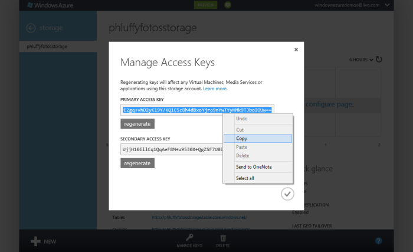

## PhluffyFotos Sample

PhluffyFotos is a Picture Gallery Service where users can upload their pictures from the web or mobile device. Users can upload, tag, and share photos in this sample.

The sample utilizes several technologies including [ASP.NET MVC 4](http://www.asp.net/mvc/mvc4), [Windows Azure SQL Databases](http://www.windowsazure.com/en-us/develop/net/how-to-guides/sql-database/) and [Windows Azure Storage](http://www.windowsazure.com/en-us/home/features/storage/), including [Tables](https://www.windowsazure.com/en-us/develop/net/how-to-guides/table-services/), [Blobs](https://www.windowsazure.com/en-us/develop/net/how-to-guides/blob-storage/), and [Queues](https://www.windowsazure.com/en-us/develop/net/how-to-guides/queue-service/). In this sample, you will see how to pull together both a web application and Windows Azure Worker role to build cloud applications. 

### Prerequisites

* [Visual Studio 2012](http://www.microsoft.com/visualstudio/en-us/products) 
* [Windows Azure SDK for .NET 1.7](http://www.windowsazure.com/en-us/develop/net/)
* [ASP.NET MVC 4](http://www.asp.net/mvc/mvc4)

### Running the Sample in Windows Azure

1. To run this sample on the cloud you need a Windows Azure Subscription. If you don't have a Windows Azure account, you can sign up for a free trial [here](http://bit.ly/windowsazuretrial).

1. Log in to the [Windows Azure Portal](https://manage.windowsazure.com/).

1. Click the **New** menu button, then select **Storage** -> **Quick Create** and give your storage account a name. Then click the check button to create the storage account. 

	

1. Click the **New** menu button, then select **Web Site** -> **Quick Create**. Then, give the web site a name and click the check button to create a web site. 

	

1. click the **New** menu button, then select **Cloud Service** -> **Quick Create**. Then, give the cloud service a name and click the check button to create the service. 

	

1. Click the **New** menu button, then select **SQL Database** -> **Quick Create**. Enter in a name for the database, a login name, and a password. Then, click the check button to create the Windows Azure SQL Database. 

	

1. Click on the **All Items** navigation menu item, and you should see the 4 resources you just finished creating. One or more of them may take longer than others to complete, but they should all eventually be created and be visible within the **All Items** view. 

	

1. If not already open, open up the Visual Studio 2012 solution from the source code download associated with this sample. Expand the **PhluffyFotos** project node and find the **ServiceConfiguration.Cloud.cscfg** file. Open that file in Visual Studio 2012. Find the **DataConnectionString** and **Microsoft.WindowsAzure.Plugins.Diagnostics.ConnectionString** settings in the file. Note the strings **{YOUR-ACCOUNT}** and **{YOUR-ACCOUNT-KEY}** in the settings' value attribute. Replace the string **{YOUR-ACCOUNT}** with the name of the storage account you created earlier. Leave the file open once you make the change.

	

1. Go back to the Windows Azure portal. Click the storage account you created to get to that account's dashboard. Once there, click the **Manage Keys** button in the bottom navigation bar. This will open up a dialog containing the primary and secondary access keys for the storage account. Copy the primary key to your clipboard. 

	

1. Go back to Visual Studio 2012. In the **ServiceConfiguration.Cloud.cscfg** file you just edited, find the string **{YOUR-ACCOUNT-KEY}** in both the **DataConnectionString** and **Microsoft.WindowsAzure.Plugins.Diagnostics.ConnectionString** settings in the file. Replace string with the key you just copied from the Windows Azure portal storage dashboard. 

	

1. Copy the entire connection string from the **DataConnectionString** setting node's value attribute. Expand the **PhluffyFotos.Web** project and find the **Web.config** file at the root of the web site. Open the file up, and locate the **DataConnectionString** element. Paste the value you just copied to your clipboard into the **value** attribute of the and save the file. Leave the **Web.config** file open, as you'll be making one more change in the next step. 

	

1. In the Windows Azure portal, click the Windows Azure SQL Database you created to open up the database's dashboard page. Click the **Show connection strings** link from the dashboard page. 

	

1. In the dialog that opens, select the text from the first textbox and copy it to your clipboard. Note, the password value will be omitted when you copy the connection string, so you'll need to have the password memorized for the next step. 

	

1. Go back to the **PhluffyFotos.Web** project's **Web.config** file. Paste the connection string you just copied into the **value** attribute of the **DefaultConnection** connection string. Then, replace the string **{your_password_here}** with the password you used when you created the Windows Azure SQL Database earlier. 

	

1. Close both the **ServiceConfiguration.Cloud.cscfg** and **Web.config** files if you haven't already. 

1. Right-click the **PhluffyFotos** project and select the **Publish** context menu item. 

1. In the **Windows Azure Publish Sign In** dialog that opens, click the link labeled **Sign in to download credentials**, if your account isn't already visible from the **Choose your subscription** menu. 

	

1. Your web browser will open and will go to the Windows Azure profile download page. When asked if you'd like to download the file to your local workstation, click the **Save** button and save the file to your hard drive. 

	

1. Once the file has downloaded, go back to the **Windows Azure Publish Sign In** dialog in Visual Studio 2012 and click the **Import** button. Find the file you just saved and click the OK button to import the file. Once you import the publish settings file, you should see your Windows Azure subscription from the drop-down menu. Click the **Next** button to continue the deployment. 

	

1. Leave the settings as they are in the subsequent dialog. Click the **Next** button to continue with the deployment. 

	

1. In the final step of the publish process, just click the **Publish** button to deploy the Cloud Service to Windows Azure. 

	

1. The **Windows Azure Activity Log** window should open in Visual Studio 2012 and show you the deployment status until it has completed. This deployment process could take a few minutes to complete. 

	

1. In the Windows Azure portal, click the web site you created earlier to view the site's dashboard. 

	

1. Click the link in the **Quick links** navigation panel labelled **Download publish profile**.

	

1. Save the file to your workstation. 

	

1. Right-click the **PhluffyFotos.Web** project in Visual Studio 2012. Select **Publish** from the context menu.

	

1. In the **Web Deploy** dialog that appears, click the **Import** button to import the web publishing profile you just downloaded. Find the publish settings file for the web site you just downloaded. Then, click the **Next** button.

	

1. Click the **Validate connection** button to verify that the publish settings function properly. Once the validation succeeds, click the **Publish** button. 

	

1. Once the site is deployed, it will open in your web browser. Click the **Sign In** link. Log in using the username **admin** and the password **123456abc**, and you'll be able to create albumbs and upload them. The default username and password are stored in the web config. The first time the application runs, the user account is created in the Windows Azure SQL Database you created earlier. 

	

## MSDN Code Sample ###
This sample is also available on the [MSDN Windows Azure Code Samples site](http://code.msdn.microsoft.com/PhluffyFotos-Sample-7ecffd31). If you would like to download a ZIP file containing all the source code for the sample it is available [here](http://code.msdn.microsoft.com/PhluffyFotos-Sample-7ecffd31/file/63060/1/PhluffyFotos.zip). 